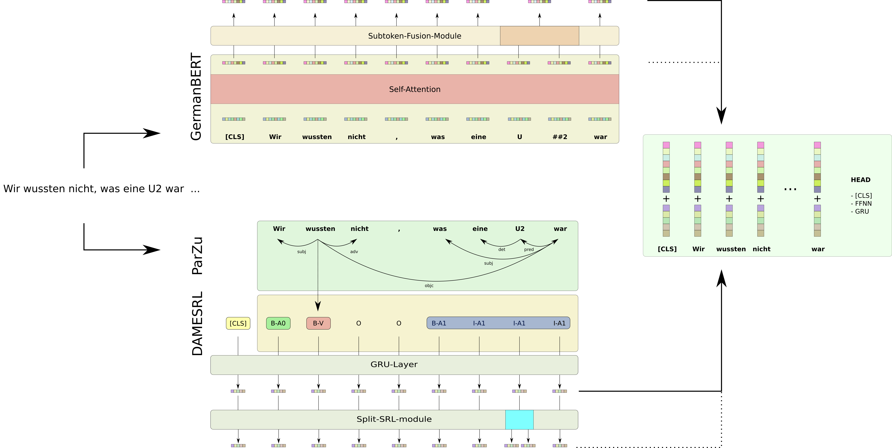
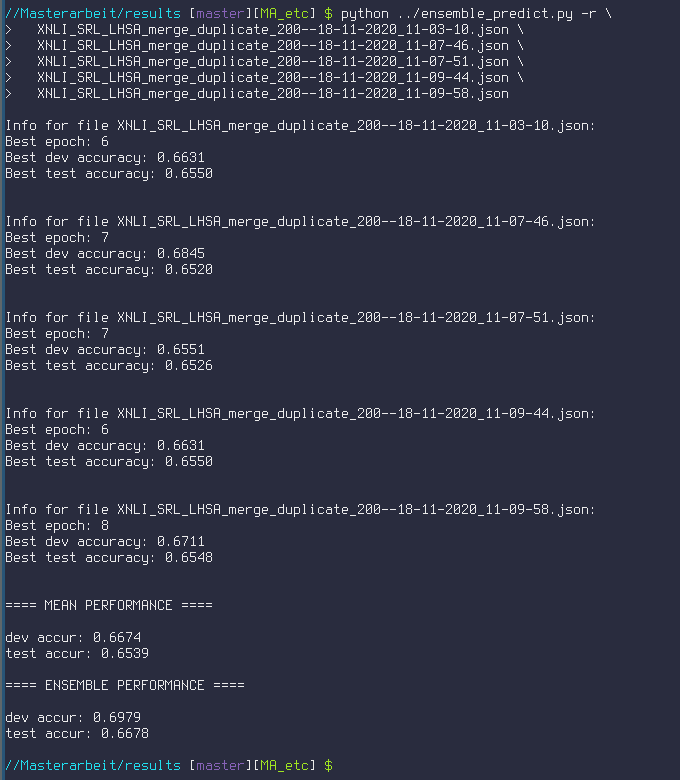

# Enriching BERT Embeddings with Semantic Role Labels for Natural Language Understanding Tasks in German

This repository contains all code files relating to my [MA thesis](https://github.com/JonathanSchaber/Masterarbeit/blob/master/Schaber-Enriching_BERT_Embeddings.pdf).

To reproduce the results, run the commands under [Preparing the Data](#preparing-the-data)

# Architecture

# Data

Overview of the data sets used in the experiments.

| Data Set | NLP Task | ML Task | \# Examples | Splits |
| -------- | -------- | ------- | ----------- | ------ |
| [deISEAR](https://www.ims.uni-stuttgart.de/forschung/ressourcen/korpora/deisear/) |  Emotion Detection | Multi-Class Classification  | 1,001 | - |
| [MLQA](https://github.com/facebookresearch/MLQA) | Question Answering | Span Prediction | 509/4,499 | dev/test |
| [PAWS-X](https://github.com/google-research-datasets/paws/tree/master/pawsx) | Paraphrase Identification | Binary Classification | 49,402/2,000/2,000 | train/dev/test |
| [SCARE](http://romanklinger.de/scare/) | Sentiment Analysis | Multi-Class Classification | 1,760 | - |
| [XNLI](https://cims.nyu.edu/~sbowman/xnli/) | Natural Language Inference | Multi-Class Classification |  2,489/5,248 | dev/test |
| [XQuAD](https://github.com/deepmind/xquad) | Question Answering | Span Prediction |  1,192 | - |

<!-- | [SCARE Reviews](http://romanklinger.de/scare/) |  Sentiment Analysis | Multi-Class Classification | 802,860 | - | -->

# Results

# Preparing the Data

Download the data and adhere to the following folder structure (it is important that the names of the directories are exactly the same as below; e.g. «deISEAR» and not «deISEARenISEAR» as it is named when downloaded etc. The structure of the downloaded data sets is not changed, so naming the root directory correctly is the main thing to follow):

	/<path>/<to>/deISEAR/
			├─deISEAR.tsv

	/<path>/<to>/MLQA/
			├─dev/
				├─dev-context-de-question-de.json
			├─test/
				├─test-context-de-question-de.json

	/<path>/<to>/PAWS-X/
			├─de/
				├─dev_2k.tsv
				├─test_2k.tsv
				├─translated_train.tsv

	/<path>/<to>/SCARE/
			├─scare_v1.0.0/annotations/
				├─alarm_clocks.csv
				├─alarm_clocks.rel
				├─alarm_clocks.txt
				├─...

	/<path>/<to>/XNLI/
			├─XNLI-1.0/
				├─xnli.dev.de.tsv
				├─xnli.test.de.tsv

	/<path>/<to>/XQuAD/
			├─xquad/
				├─xquad.de.json

# SRL Resources

## ParZu

Clone the [repository](https://github.com/rsennrich/ParZu/) and configure
config.ini file to run locally on your machine.

`$ export PYTHONPATH="${PYTHONPATH}:/<path>/<to>/ParZu"`

## DAMESRL

Download the source code from [here](https://liir.cs.kuleuven.be/software_pages/damesrl.php)
in a local folder `DAMESRL`, and configure `config/charatt_ger_pred_infer.ini` to run
locally on your machine.

`$ export PYTHONPATH="${PYTHONPATH}:/<path>/<to>/DAMESRL"`

## Pre-Preprocessing

Run the following bash commands to prepare the data sets for the python scripts:

#### SCARE

When you obtained the .txt files, move them to the folder «annotations», where the other files (.csv etc.) lie.

cd into the folder «annotations»:

`$ cd /<path>/<to>/SCARE/scare_v1.0.0/annotations/`

cat all the .txt and .csv files into one file, respectively:

`$ cat *.txt > annotations.txt && cat *.csv > annotations.csv`

<!-- #### SCARE Reviews

cd into the folder «reviews»:

`$ cd /<path>/<to>/SCARE/scare_v1.0.0_data/reviews/`

cat all the .csv files into one .csv files:

`$ cat *.csv > reviews.csv` -->

## Preprocessing

For each data set, run the following command:

	$ python preprocess_data.py \
		-d <data set> \
		-p /<path>/<to>/<data set>/ \
		-a /<path>/<to>/DAMESRL/<config>/srl_char_att_ger_infer.ini

This will create in each data set directory the following three files, their names starting with `GliBERT_` (example for deISEAR):

    /<path>/<to>/deISEAR/
            ├─GliBERT_deISEAR_dev.tsv
            ├─GliBERT_deISEAR_test.tsv
            ├─GliBERT_deISEAR_train.tsv

# Training a model

First, adjust the paths in `config.json` to conform to the structure on your
machine and/on the remote machine you intend to train on. The paths for the
dataset point to the directory, where the `Gli_BERT*.tsv` files lie.

    $ python gli_bert.py \
        -l <local/remote> \
        -c config.json \
        -d <data set> \
        -s <file name result files>

# Evaluating / Ensemble predict

After training a model, its results and actual predictions get written to two files:

    <file name result files>.json
    <file name result files>.results.json

The former contains information about the hyperparameters used during training (the passed config
file is simply written to it) and for each epoch the loss and accuracy for all sets are reported.
In the latter, the actual predictions and gold labels for the development and test set for each epoch
are written.

To quickly see in which epoch(s) the development set accuracy was the highest, run:

    $ max_acc.sh <file name result files>.json

The script shows some metrics about the best epoch:

For evaluating a model ensemble, run the following:

    $ python ensemble_predict.py -r \
        <file name result files 1>.json \
        <file name result files 2>.json \
        ... \
        <file name result files n>.json

You will see the following output: For each model, the best development set epoch gets selected
according to the accuracy the model achieved (if there are multiple epochs with the same development
set accuracy, the first gets selected). Then, the actual predictions for each model on the respective
best epoch get ensembled and a majority vote is carried out:

To control for two models, or ensembles, if the differences between the control
(`-c`) and test (`-t`) one are statistically significant, run the following command:

    $ python test_significanc.py -c \
        <control file 1>.json \
        <control file 2>.json \
        ...
        <control file n>.json \
        -t \
        <test file 1>.json \
        <test file 2>.json \
        ...
        <test file n>.json

# Miscellaneous

The following command takes one results file as input and plots two graphs, the
loss and accuracy development of its mode:

    $ Rscript --vanilla R_scripts/graphs.R <results file>.json

